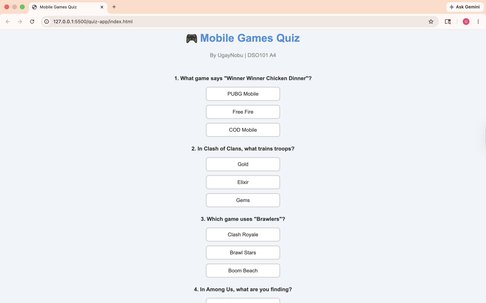
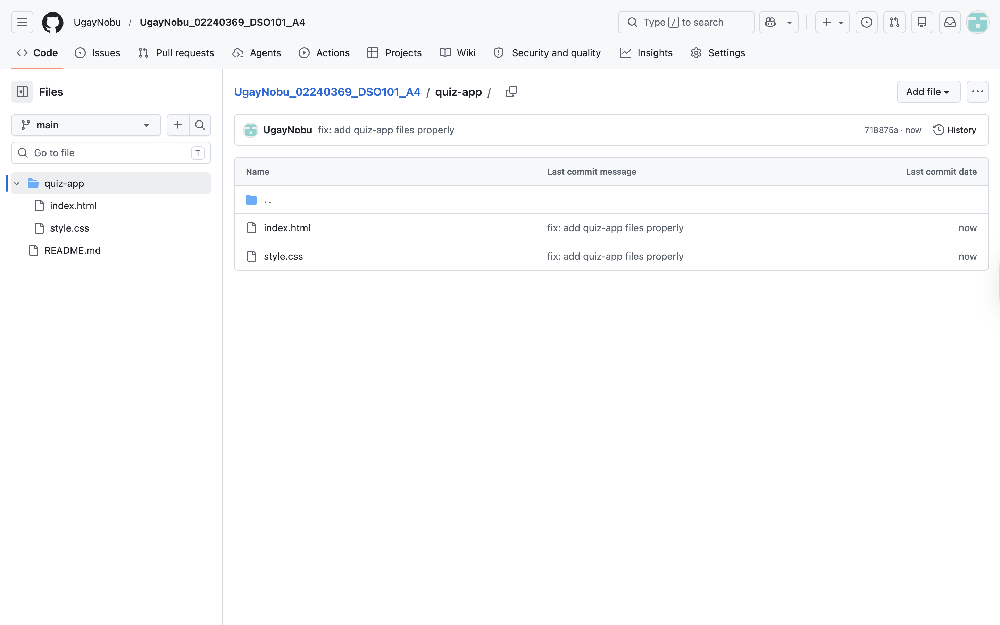
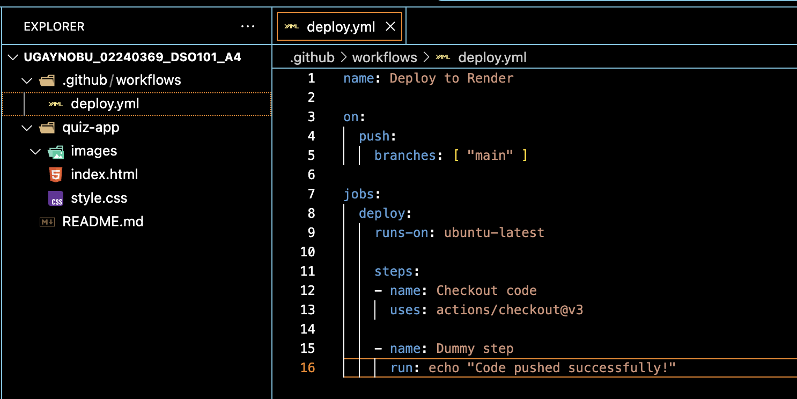
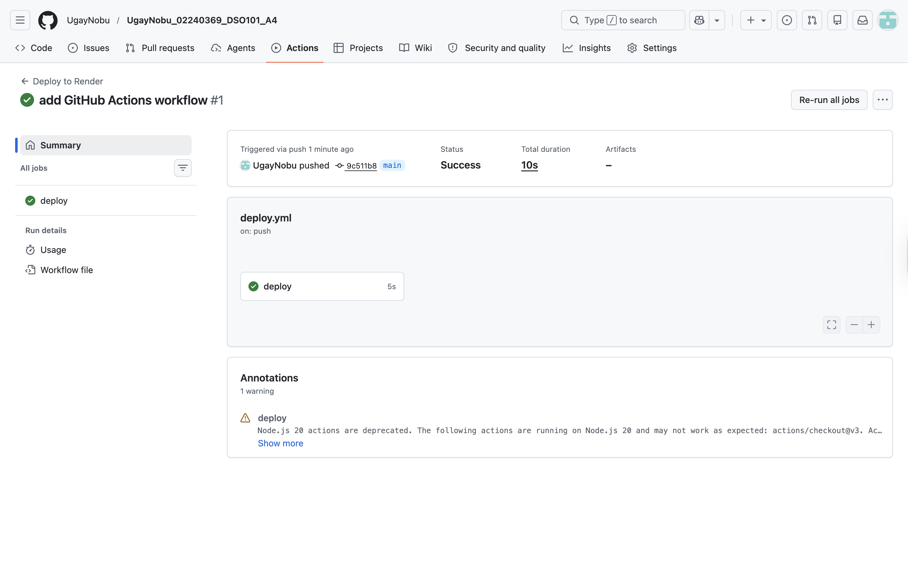
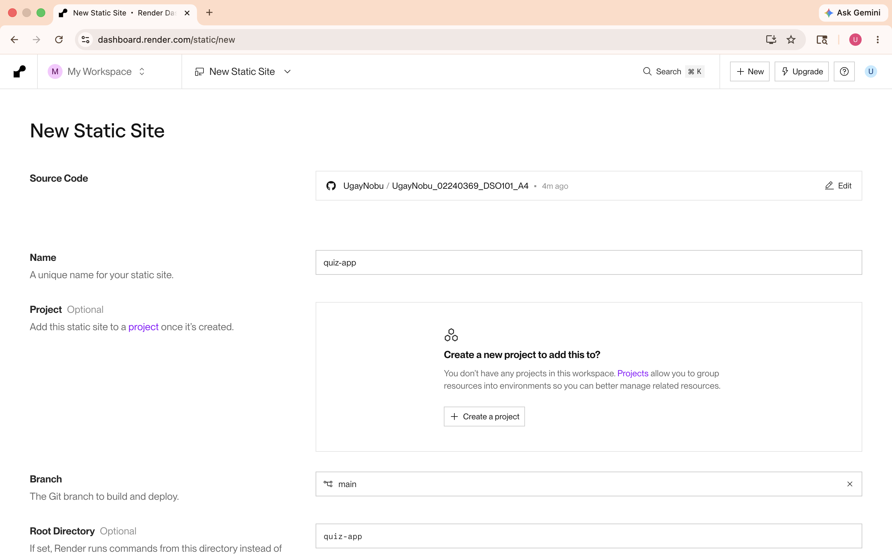
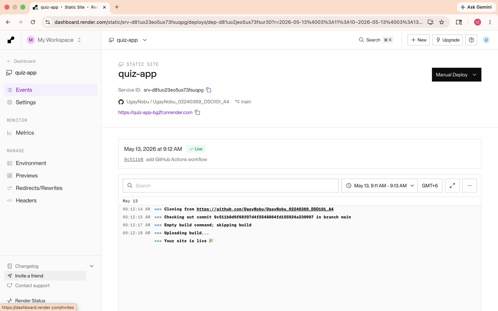
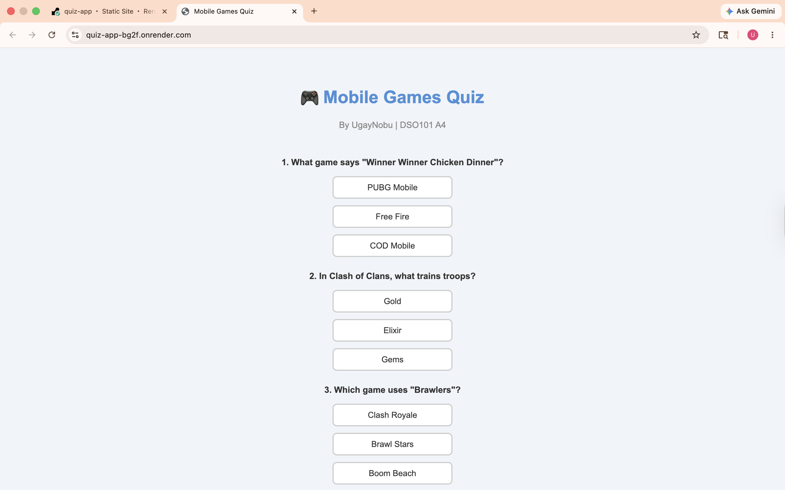

# DSO101 Assignment 4 — Deploy Your First Web App

**Student:** UgayNobu  
**Student ID:** 02240369  
**Course:** DSO101 - Continuous Integration and Continuous Deployment  

---

## Task 1 — Create the Application

### Step 1: Create the project folder and files

Created a static website — a Mobile Games MCQ Quiz using HTML and CSS.



---

## Task 2 — GitHub Setup

### Step 1: Push code to GitHub

Pushed the `quiz-app` folder containing `index.html` and `style.css` to the GitHub repository.

```bash
git add .
git commit -m "fix: add quiz-app files properly"
git push
```



---

## Task 3 — GitHub Actions Workflow

### Step 1: Create the workflow file

Created `.github/workflows/deploy.yml` to automate deployment on every push to main.



### Step 2: Verify workflow runs successfully

Pushed the workflow file and confirmed GitHub Actions ran successfully.



---

## Task 4 — Deploy on Render

### Step 1: Configure Render Static Site

Connected the GitHub repo to Render as a Static Site with `quiz-app` as the root directory.



### Step 2: Deployment successful

Render deployed the site and showed Live status.



### Step 3: Verify live site

Opened the live URL and confirmed the quiz works correctly.



---

## Results

| Criteria | Status |
|---|---|
| GitHub repo setup | ✅ |
| Basic application (HTML + CSS) | ✅ |
| GitHub Actions workflow | ✅ |
| Successful deployment on Render | ✅ |
| Documentation (README) | ✅ |

---
## Live URL

| Service | URL |
|---|---|
| Render | https://quiz-app-bg2f.onrender.com |
| GitHub Repo | https://github.com/UgayNobu/UgayNobu_02240369_DSO101_A4 |

---

## References

- [GitHub Actions Documentation](https://docs.github.com/en/actions)
- [Render Static Site Docs](https://render.com/docs/static-sites)
- [Git Documentation](https://git-scm.com/doc)